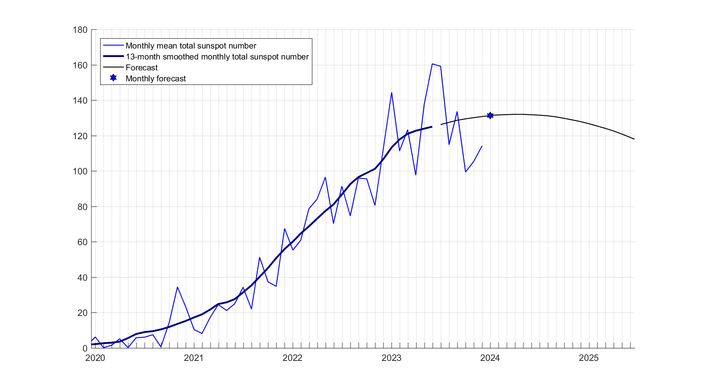
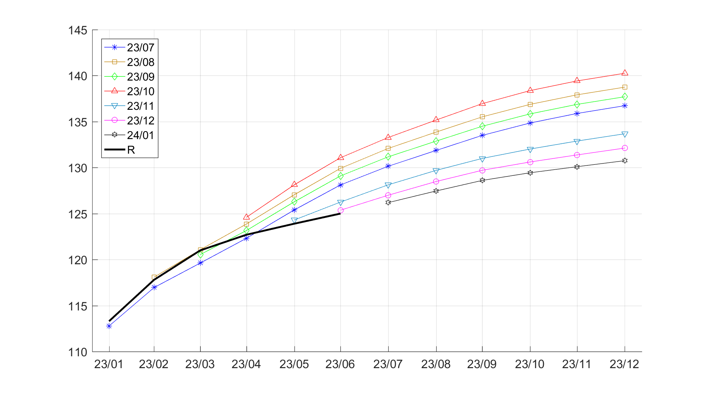
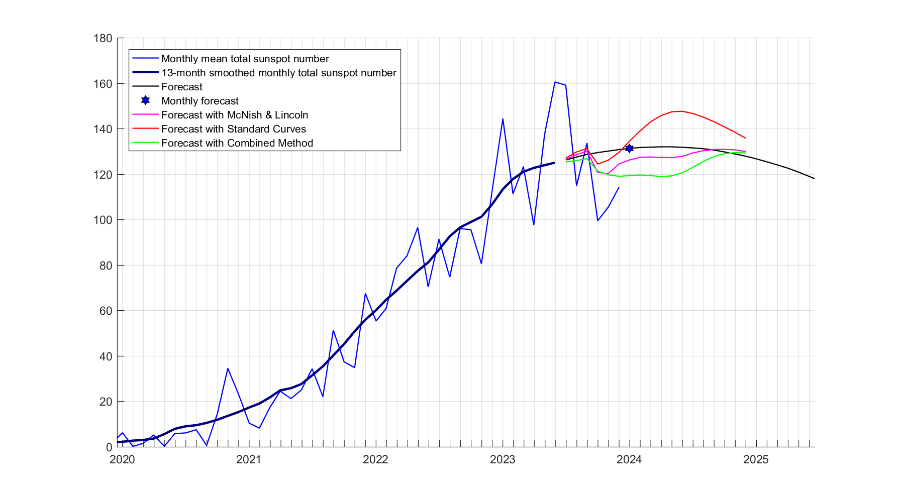

# Forecast of Monthly Sunspot numbers

## Description

This repository contains data and figures of Sunspot numbers forecast. 
Only the data of 13-month smoothed monthly total sunspot number time series is predicted.

The forecast is estimated with a method based on a combination of numerical solution of nonlinear mean-field dynamo equations and two-layer artificial neural network.
The presented methodology is a continuous scientific work relying on several publications (https://doi.org/10.1093/mnras/stw1267 ; https://doi.org/10.1017/S0022377818000600 ; https://doi.org/10.1007/s10511-019-09579-2 ; https://doi.org/10.1093/mnras/staa1047) 

## Repository directories
1) `data` have directories and subdirectories format of YYYY\MM with corresponding Year-Month, and contains initial data of monthly mean total sunspot numbers (SN_m_tot_V2.0.txt) and 13-month smoothed monthly total sunspot number (SN_ms_tot_V2.0.txt) plus 6 files (\*predi\*.txt) with forecasts provided by WDC-SILSO, Royal Observatory of Belgium, Brussels. All files are in ASCII text and can be opened in any text editor.
2) `figs` have directories and subdirectories format of YYYY\MM with corresponding Year-Month, and contains figures of actual forecast (same 3 plots as on this page for every month) in fig (MATLAB HDF5), eps (Encapsulated PostScript), png, svg formats.
3) `forecast` contains plain ASCII text files of the actual forecast for the 13-month smoothed monthly total sunspot number time series named R_*YY*_*MM*.txt with corresponding Year-Month.

Observational Sunspot data is provided by the World Data Center SILSO, Royal Observatory of Belgium, Brussels (https://www.sidc.be/silso/datafiles).

### Actual forecast

### Latest monthly forecast estimations and observations `R`

### Comparison with the other methods of forecast

Data for the other 3 forecasts presented here for comparison are provided by the World Data Center SILSO, Royal Observatory of Belgium, Brussels (https://www.sidc.be/SILSO/forecasts).

